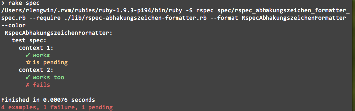

# Rspec::Tick::Formatter

Rspec3 port of rspec-abhakungszeichen-formatter that pleases developers eyes

Forked from the orignal Rspec::Abhakungszeichen::Formatter

## Why Rename?

Because I can't pronounce Abhakungszeichen

## Installation

install formatter:

    $ gem install rspec-tick-formatter

## Usage

    $ rspec --format RspecTickFormatter --color my_spec.rb

## Contributing

1. Fork it
2. Create your feature branch (`git checkout -b my-new-feature`)
3. Commit your changes (`git commit -am 'Add some feature'`)
4. Push to the branch (`git push origin my-new-feature`)
5. Create new Pull Request
